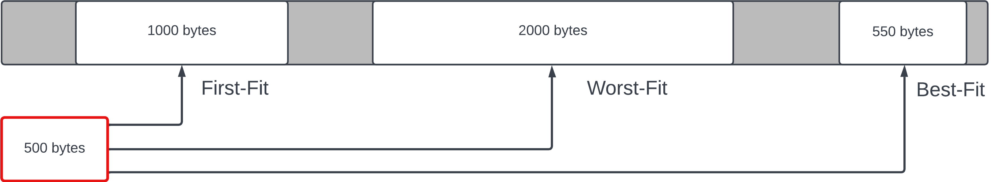
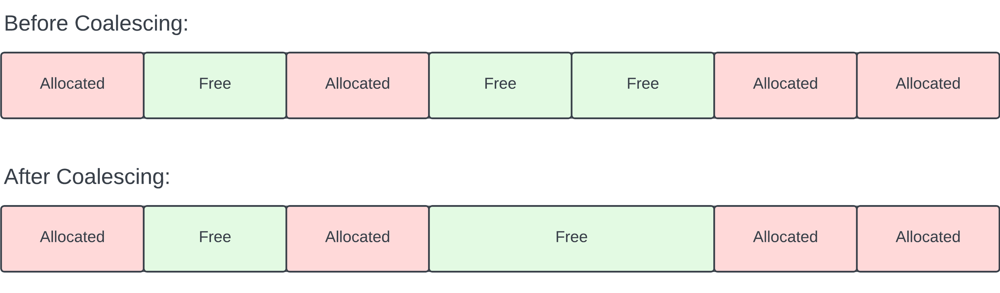

# Custom Malloc and Free

This library provides a custom implementation of memory allocation (`my_malloc`) and deallocation (`my_free`) using a doubly-linked list of memory blocks. The primary goal is to manage memory dynamically, allowing users to allocate and free memory as needed.

## Features

- **Memory Allocation**: The `my_malloc` function allocates memory blocks, searching for a suitable free block or splitting a larger block using the first-fit algorithm.

- **Memory Deallocation**: The `my_free` function marks a previously allocated block as free and coalseces adjacent free blocks to optimize memory usage.

- **Initialization**: The `mem_init` function initializes the custom memory allocation library by allocating a main memory block and intializing the linked list.

## Why First Fit?

The memory allocation strategy used in this code is the "first-fit" algorithm, where the first available block that satisfies the allocation size is chosen. This strategy is a simple methodology where the suitable free block in the list is used, as opposed to the best-fit, improving runtime at the cost of slight external fragmentation.

### First-Fit Diagram:



In this example diagram, an item of size 500 is attempting to be allocated within a memory block featuring three open blocks of sizes 1000, 2000, and 550. The first fit algorithm selects the first available block with sufficient space (in this case, the 1000-sized block) for the requested item. Any extra space will be split into a new free block.

## What is Coalescing?

Coalescing is a memory management technique used to merge adjacent free blocks into a single, larger free block. This helps prevent external memory fragmentation and ensures more efficient use of available memory. As the inital memory block is used up however, coalescing becomes less effective.

### Coalescing Diagram:



The 'Before Coalescing' diagram depicts a memory layout with alternating allocated and free blocks, in the strucutre of a linked list. After applying memory coalescing, represented in the 'After Coalescing' diagram, adjacent free blocks are merged to create a more contiguous and efficient memory space. This process is done everytime `my_free` is called, minimizing external fragmentation.

## Installation and Use

1. Clone the repository to your local machine:

   ```bash
   git clone https://github.com/your_username/custom-malloc-free-c.git
   ```

2. If using the provided test file, simply run using the included make file:

    ```bash
    make
    ./mem_test
    ```

    Else include the library header in your own C file:

    ```bash
    #include "my_malloc.h"
    ```

3. To adjust maximum size of the allocated block, adjust `TOTAL_BLOCK` value within `my_malloc.h`:

    ```bash
    #define TOTAL_BLOCK 1000
    ```

4. Initiate the library within main:

    ```bash
    mem_init();
    ```

5. To use allocated memory, call as you would `malloc`, for example, to allocate a single `int`:

    ```bash
    int *int1 = (int *)my_malloc(sizeof(int));
    ```

6. To free memory, call as you would `free`:

    ```bash
    my_free(int1);
    ```

7. Free the inital memory block at the very end of your program to clean up:

    ```bash
    free_block();
    ```

## Contact

Feel free to reach out if you have any questions, suggestions, or feedback:

- **Email:** dpa45@sfu.ca
- **LinkedIn:** [@Daksh Patel](https://www.linkedin.com/in/daksh-patel-956622290/)